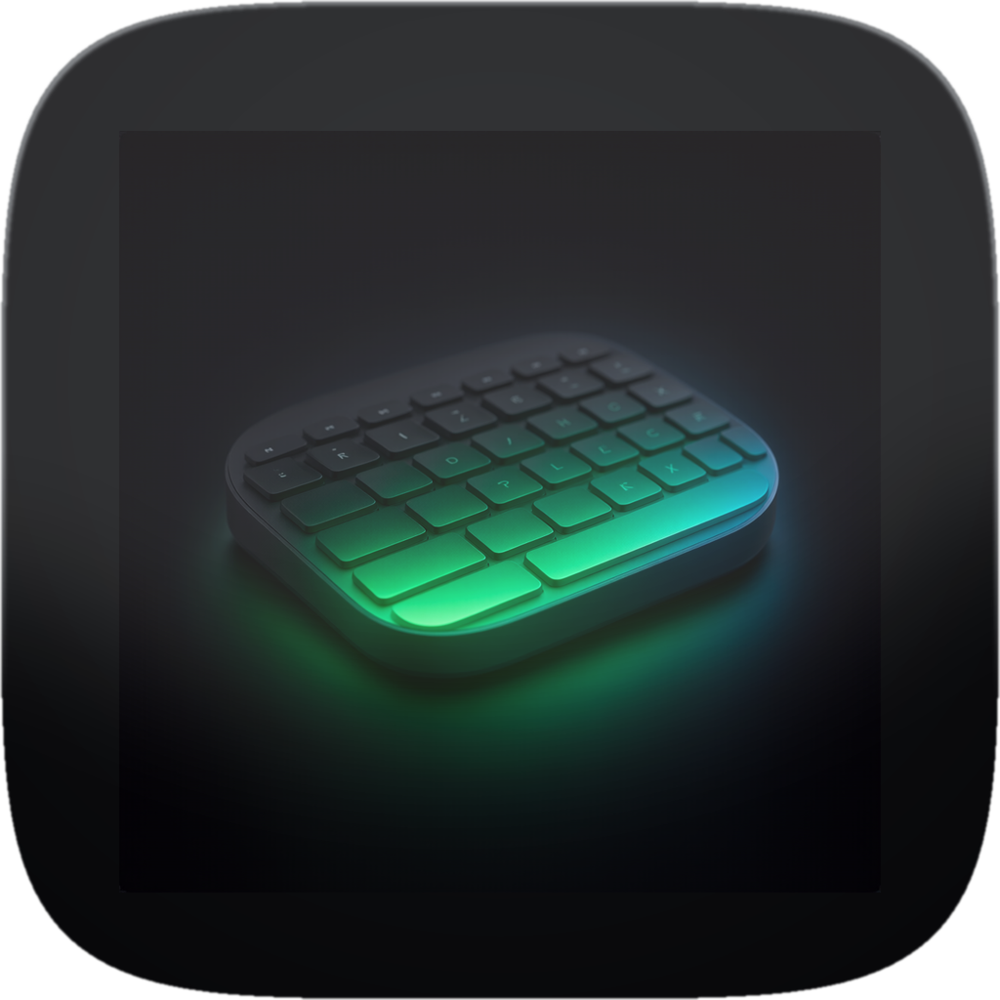
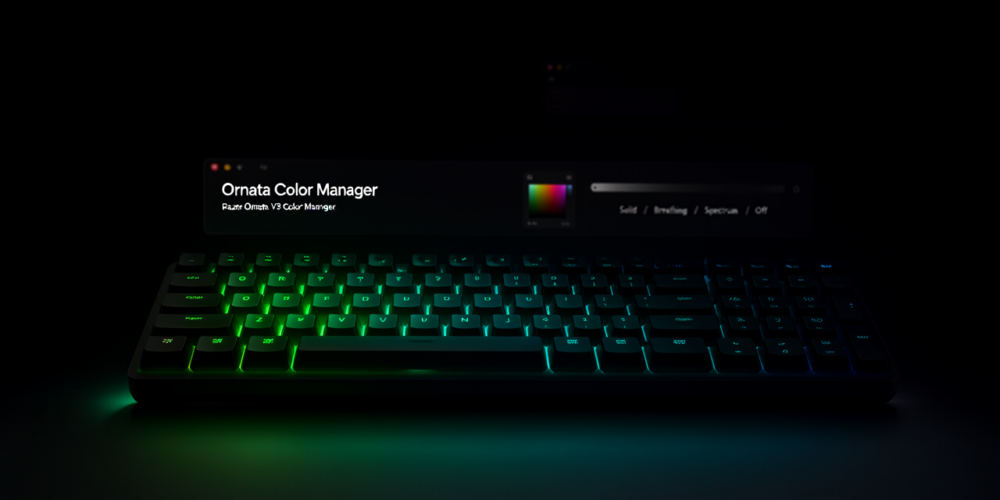

# Keyboard color for the Razer Ornata V3 X

<p align="center">
  
</p>

A macOS application that sets the RGB color, brightness, and lighting effects of the Razer Ornata V3 X. The keyboard lights as one zone: Solid, Breathing, Spectrum, and Off. No Razer Synapse.

<p align="center">
  <a href="#requirements"></a>
  <a href="#requirements"></a>
  <a href="#what-it-controls"></a>
  <a href="#what-it-controls"></a>
</p>

<p align="center">
  
</p>

Use this instead of installing half a gigabyte of spyware.

## Requirements

- **macOS 14** or later
- A **Razer Ornata V3 X** on USB
- **Swift** (`./run.sh` builds the window from this repository)

## Run

```sh
./run.sh
```

Builds `KeyboardColor` and opens the window. It does not listen on a port. It talks only to the Razer lighting. It doesn't need every permission under the sun.

## Install

```sh
./package.sh
```

Writes `dist/RazerColorManager.dmg`. Open it and drag Razer Color Manager onto Applications.

## What It Controls

- **Color**: For Solid and Breathing modes. The color well sends a color to the keyboard; the keys do not report a color back.
- **Intensity**: Brightness from 0% to 100%. Opening the window reads brightness from the keyboard. Setting 0% dims the current effect. Off is its own control.
- **Effect**: Solid, Breathing, Spectrum, or Off. The accepted effect is marked after a command succeeds.

One lighting zone. Live updates. Looking again reads brightness again and leaves a color this window already sent.

## Permissions & macOS Access

The application communicates with the Razer lighting interface through macOS HID (`IOKit`) APIs.

### Interface Access & Non-Seizing
`KeyboardSession.swift` opens the lighting report interface using `kIOHIDOptionsTypeNone` (see [`KeyboardSession.swift`](Sources/KeyboardColor/KeyboardSession.swift#L134-L178)). It opens the lighting control without seizing exclusive access to the keyboard. Seizing the keyboard interface would stop normal keyboard typing.

### Blocked Access State
If macOS blocks access to the lighting interface, `IOKit` returns `kIOReturnNotPermitted` (handled in [`KeyboardSession.swift`](Sources/KeyboardColor/KeyboardSession.swift#L162-L176)).

When this happens:
- The application surfaces a **Blocked** status in the window.
- The keys can still type normally.
- Input Monitoring can hide the keyboard from this window even while the keys still type.

## How It Talks to the Keyboard

The app opens the Ornata lighting control through macOS HID APIs (`IOKit`) and leaves the keys to the system. It does not seize the keyboard, and it does not write a color when the window opens.


