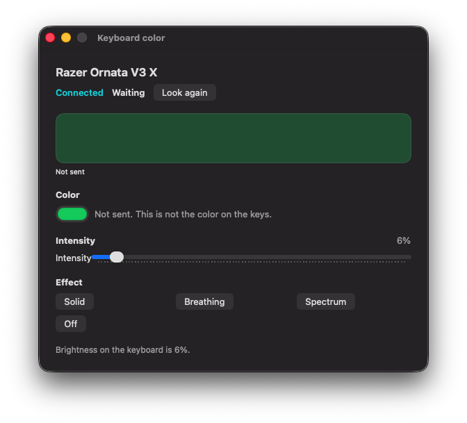

# Keyboard color for the Razer Ornata V3 X

A macOS application that sets the RGB color, brightness, and lighting effects of the Razer Ornata V3 X. The keyboard lights as one zone: Solid, Breathing, Spectrum, and Off. No Razer Synapse.

<p align="center">
  <a href="#requirements"></a>
  <a href="#requirements"></a>
  <a href="#what-it-controls"></a>
  <a href="#what-it-controls"></a>
</p>

<p align="center">
  
</p>

Use this instead of installing half a gigabyte of spyware.

## Requirements

- macOS 14 or later
- A Razer Ornata V3 X on USB
- Swift. `./run.sh` builds the window from this repository

## Run

```sh
./run.sh
```

Builds `KeyboardColor` and opens the window. It does not listen on a port. It talks only to the Razer lighting. It does not request every permission on the system.

## Install

```sh
./package.sh
```

Writes `dist/RazerColorManager.dmg`. Open it and drag Razer Color Manager onto Applications.

## What It Controls

- **Color.** For Solid and Breathing. The color well sends a color to the keyboard. The keys do not report a color back.
- **Intensity.** From 0% to 100%. Opening the window reads brightness from the keyboard. 0% dims the current effect. Off is its own control.
- **Effect.** Solid, Breathing, Spectrum, or Off. The accepted effect is marked after a command succeeds.

One lighting zone. Live updates. Look again reads brightness again and leaves a color this window already sent.

## Permissions

The app opens the Ornata lighting interface through IOKit and leaves the keys to the system. The open is `openLightingDevice()` in [KeyboardSession.swift](Sources/KeyboardColor/KeyboardSession.swift). It uses `kIOHIDOptionsTypeNone`, so the keyboard stays shared with macOS. Seizing that interface would stop typing. The window does not send a color when it opens.

If the window says **Blocked**, macOS refused that open (`kIOReturnNotPermitted`). The keys can still type.
